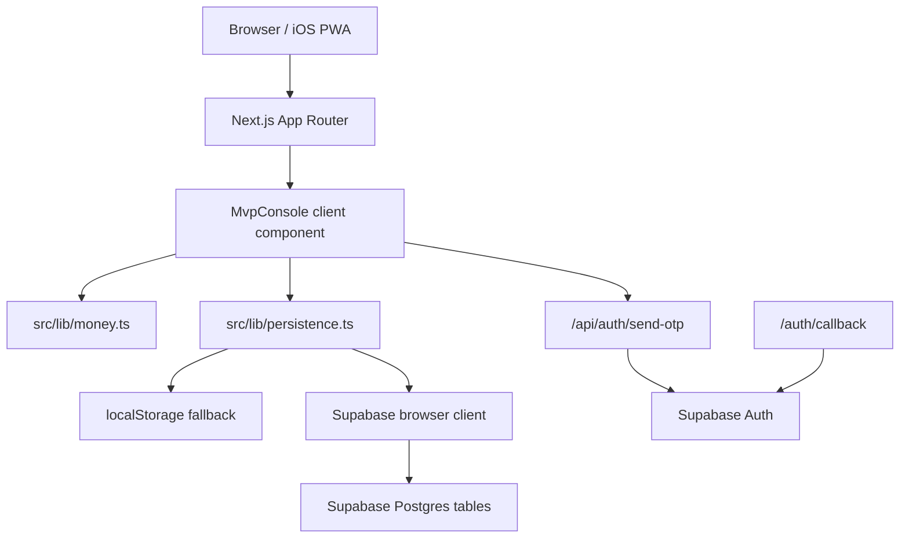

# Spendly Architecture

Spendly is a Next.js PWA for pre-spend decision support. The architecture is intentionally small: one interactive client console, one pure financial rule module, and one persistence adapter that can use either Supabase or browser storage.

## Goals

- Keep the core product loop fast enough to use immediately before payment.
- Keep money calculations transparent and testable.
- Allow local-only usage during development or when Supabase is not configured.
- Support passwordless Supabase sign-in when cloud persistence is enabled.
- Preserve iOS PWA readiness for the first release path.

## System Overview



## Runtime Components

### Next.js App Router

The application uses Next.js App Router under `src/app`.

- `src/app/page.tsx` is the public overview page.
- `src/app/app/page.tsx` is the main app route and renders `MvpConsole`.
- `src/app/layout.tsx` defines metadata, iOS web app settings, and the manifest path.
- `src/app/manifest.ts` returns the installable PWA manifest.
- `src/app/api/auth/send-otp/route.ts` starts passwordless sign-in.
- `src/app/auth/callback/route.ts` exchanges Supabase magic-link codes for a session.

### Client Console

[src/components/mvp-console.tsx](/Users/wuikeat/Projects/playground/spendly/src/components/mvp-console.tsx) owns the main product state and user flows:

- onboarding profile setup,
- current balance updates,
- purchase checks,
- spend recording,
- recent history display,
- recovery mode messaging,
- OTP email sign-in and verification,
- sign-out and data reset.

It delegates all safe-to-spend decisions to `money.ts` and all storage/auth work to `persistence.ts`.

### Rule Engine

[src/lib/money.ts](/Users/wuikeat/Projects/playground/spendly/src/lib/money.ts) is the pure domain layer. It has no React, browser, or Supabase dependency.

Core concepts:

- `ProfileInput`: income, commitments, balance, protected buffer, and last balance update.
- `Snapshot`: derived spendable balance, safe daily pace, confidence, status, and headline.
- `PurchaseCheck`: one checked purchase and its verdict.
- `Verdict`: `Safe`, `Risky`, or `Not safe`.

Primary rules:

```text
spendableBalance = currentBalance - protectedBuffer
safeDaily = spendableBalance / remainingDaysInMonth
```

Decision behavior:

- Stale balance data returns a `Risky` verdict and asks the user to refresh.
- A purchase that breaks protected money returns `Not safe`.
- A purchase above the daily safe pace returns `Risky`.
- A purchase within pace returns `Safe`, with a plain-language consequence.
- Recovery mode is triggered by low safe daily pace or repeated risky checks.

Because the module is pure, it is the best place to add unit tests when the rules evolve.

### Persistence Adapter

[src/lib/persistence.ts](/Users/wuikeat/Projects/playground/spendly/src/lib/persistence.ts) hides storage details from the UI.

It chooses a mode at runtime:

- `local`: used when Supabase env vars are missing or Supabase boot fails.
- `supabase`: used when `NEXT_PUBLIC_SUPABASE_URL` and a publishable key are present.

Local mode stores a compact state object under the browser key `ringly-mvp-state`.

Supabase mode:

- reads the current auth session,
- loads the signed-in user's profile,
- loads the latest eight purchase checks,
- upserts profile changes,
- inserts purchase checks,
- clears user-owned profile and check rows when data is reset.

Supabase calls are wrapped with a short timeout so the app can fall back instead of blocking the user indefinitely.

## Authentication Flow

Spendly uses passwordless email auth.

1. The user submits an email in `MvpConsole`.
2. The client calls `signInWithMagicLink()` in `persistence.ts`.
3. `signInWithMagicLink()` posts to `/api/auth/send-otp`.
4. The route calls `supabase.auth.signInWithOtp()` with `/auth/callback` as the redirect URL.
5. The user either opens the magic link or enters the OTP code.
6. For magic links, `/auth/callback` exchanges the code for a session and redirects to `/app`.
7. For OTP entry, the browser client calls `verifyOtp()`.
8. `MvpConsole` reloads persisted state after successful verification.

The send-OTP route includes an in-memory email/IP rate limit. This is useful for the prototype, but production should move rate limiting to durable infrastructure.

## Data Model

Supabase changes are versioned under [supabase/migrations](/Users/wuikeat/Projects/playground/spendly/supabase/migrations). The current schema snapshot is kept in [supabase/schema.sql](/Users/wuikeat/Projects/playground/spendly/supabase/schema.sql) for easy reading.

### `profiles`

One row per authenticated user.

Important columns:

- `user_id`: primary key and foreign key to `auth.users`.
- `monthly_income`
- `monthly_commitments`
- `current_balance`
- `protected_buffer`
- `last_balance_update`
- `created_at`
- `updated_at`

### `purchase_checks`

Recent safe-to-spend decisions.

Important columns:

- `id`: client-generated UUID.
- `user_id`: foreign key to `auth.users`.
- `amount`
- `verdict`
- `consequence`
- `checked_at`
- `created_at`

Both tables have row level security enabled. Policies allow a user to manage only rows where `auth.uid() = user_id`.

## Main Data Flows

### First Use

1. App loads `/app`.
2. `MvpConsole` calls `loadPersistedState()`.
3. If Supabase is unavailable, local state is loaded.
4. If Supabase is configured but no session exists, the app shows sign-in.
5. If no profile exists, the app shows onboarding.
6. Submitted profile is saved through `saveProfile()`.

### Purchase Check

1. User enters a purchase amount.
2. `MvpConsole` calls `checkPurchase(profile, amount)`.
3. The result is displayed immediately.
4. A `PurchaseCheck` entry is added to local UI history.
5. `savePurchaseCheck()` persists the check.

### Record Spend

1. User confirms that a checked spend happened.
2. The app subtracts the checked amount from `currentBalance`.
3. `lastBalanceUpdate` is refreshed.
4. The profile is persisted.
5. The visible safe-to-spend snapshot is recalculated.

## Progressive Web App Behavior

Spendly is prepared for an iOS-playable PWA path:

- `manifest.ts` sets `start_url` to `/app`.
- `layout.tsx` sets Apple web app metadata.
- global CSS accounts for safe-area insets.
- input font sizes avoid iOS focus zoom.
- the app is designed around portrait mobile usage.

See [docs/ios-release-readiness.md](/Users/wuikeat/Projects/playground/spendly/docs/ios-release-readiness.md) for the release checklist.

## Configuration

Required only for Supabase mode:

```bash
NEXT_PUBLIC_SUPABASE_URL=your-project-url
NEXT_PUBLIC_SUPABASE_ANON_KEY=your-anon-or-publishable-key
```

`NEXT_PUBLIC_SUPABASE_PUBLISHABLE_DEFAULT_KEY` is accepted as a fallback key name.

Without these variables, the app remains usable in local mode.

## Deployment Notes

- Run `npm run build` before deployment.
- Apply Supabase migrations in filename order before using cloud persistence.
- Configure Supabase redirect URLs for each deployed domain.
- Serve over HTTPS for PWA installation and auth redirects.
- Treat the in-memory OTP email limiter as prototype-only.
- Consider adding tests around `money.ts` before changing decision thresholds.

## Known Boundaries

- There is no bank integration; the user manually maintains current balance.
- The app shows approximate guidance, not financial advice.
- Purchase history is intentionally limited to the latest eight checks in the app.
- Local mode data is device/browser-specific and can be cleared by browser storage resets.
- Serverless deployments may not preserve the in-memory OTP rate limit between invocations.
