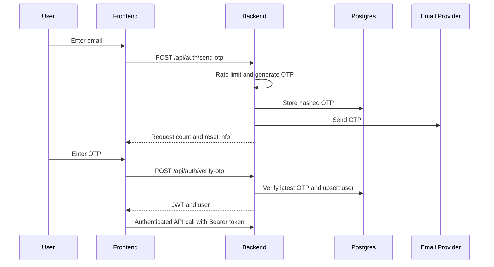

# Auth Design

## Goal

Replace Supabase passwordless email auth with a Spring Boot backend flow that
keeps the current Spendly UX:

- User enters email.
- Backend sends a sign-in email.
- User enters the email OTP code.
- Frontend receives an authenticated session.
- Frontend calls protected profile and purchase-check APIs with a bearer token.

## Recommended Approach

Use email OTP plus JWT access tokens. Magic links are intentionally sunset.

```text
Email OTP proves email ownership.
JWT access token authenticates API requests.
Refresh token keeps mobile sessions convenient.
```

Use short-lived access tokens plus longer refresh tokens. This keeps the mobile
session convenient without making the bearer access token valid for too long.

## OTP Standard

Use numeric email OTP with strict validation:

```text
Length: 6 digits
Format: numeric only, regex ^[0-9]{6}$
Expiry: 10 minutes
Send limit: 2 emails per email+IP per 60 seconds
Verify limit: 5 failed attempts per email+IP per 10 minutes
Reuse: one-time only
Storage: salted/hash encoded, never plaintext
Comparison: constant-time hash verification
Case handling: normalize email to lowercase before lookup
```

NIST SP 800-63B requires effective rate limiting for short OTP outputs; OWASP
also recommends rate limiting login/auth endpoints. Spendly will use stricter
limits than the broad NIST maximum because this is a consumer finance app.

## Core Tables

Existing Liquibase tables already prepare the baseline:

```text
app_users
  id
  email
  ref_no
  created_at
  created_by
  last_modified_at
  last_modified_by

email_otps
  id
  email
  token_hash
  expires_at
  consumed_at
  created_at
  created_by
  last_modified_at
  last_modified_by
```

```text
refresh_tokens
  id
  user_id
  token_hash
  expires_at
  revoked_at
  created_at
  created_by
  last_modified_at
  last_modified_by
```

## API Endpoints

### Send OTP

```http
POST /api/auth/send-otp
```

Request:

```json
{
  "email": "user@example.com",
  "reason": "initial"
}
```

Behavior:

1. Normalize email to lowercase.
2. Rate limit by email plus IP.
3. Generate a 6-digit OTP.
4. Hash the OTP before storing.
5. Insert `email_otps` row with a short expiry, recommended 10 minutes.
6. Send email containing the OTP code.

Response:

```json
{
  "ok": true,
  "requestCount": 1,
  "requestLimit": 2,
  "resetAt": 1780460000000
}
```

### Verify OTP

```http
POST /api/auth/verify-otp
```

Request:

```json
{
  "email": "user@example.com",
  "token": "123456"
}
```

Behavior:

1. Normalize email.
2. Find latest unconsumed, unexpired OTP.
3. Compare submitted token with stored hash.
4. Mark OTP consumed.
5. Create `app_users` row if email is new.
6. Return JWT access token and user summary.

Response:

```json
{
  "accessToken": "jwt",
  "tokenType": "Bearer",
  "expiresIn": 3600,
  "refreshToken": "opaque-random-token",
  "refreshExpiresIn": 2592000,
  "user": {
    "id": "ulid",
    "refNo": "USR01..."
  }
}
```

### Refresh Session

```http
POST /api/auth/refresh
```

Request:

```json
{
  "refreshToken": "opaque-random-token"
}
```

Behavior:

1. Hash the submitted refresh token.
2. Find an unexpired, unrevoked token.
3. Rotate the refresh token: revoke the old token and issue a new one.
4. Return a new JWT access token and refresh token.

Response shape matches `POST /api/auth/verify-otp`.

### Current User

```http
GET /api/auth/me
Authorization: Bearer <access-token>
```

Response:

```json
{
  "id": "ulid",
  "refNo": "USR01..."
}
```

### Sign Out

For access-token-only v1:

```http
POST /api/auth/sign-out
```

Frontend deletes the token locally. Backend can return `204`.

Sign-out revokes the submitted refresh token.

## Backend Package Placement

```text
controller/
  AuthController.java

dto/request/
  SendOtpRequest.java
  VerifyOtpRequest.java

dto/response/
  SendOtpResponse.java
  AuthSessionResponse.java
  CurrentUserResponse.java

entity/
  AppUser.java
  EmailOtp.java
  RefreshToken.java

repository/
  AppUserRepository.java
  EmailOtpRepository.java
  RefreshTokenRepository.java

service/
  AuthService.java
  EmailDeliveryService.java
  TokenService.java
  OtpService.java

service/impl/
  AuthServiceImpl.java
  SmtpEmailDeliveryService.java
  JwtTokenService.java
  OtpServiceImpl.java

orchestrator/
  AuthOrchestrator.java

constant/
  AuthConstants.java

exception/
  AuthException.java
```

## Auth Flow



## Security Rules

- Store OTP hashes only, never raw OTPs.
- Generate OTPs with `SecureRandom`.
- OTP expiry: 10 minutes.
- OTP length: 6 digits for email entry.
- Reject OTP values that are not exactly 6 numeric digits.
- Mark OTP consumed after successful verification.
- Invalidate older unconsumed OTPs for the same email after successful login.
- Reject expired or consumed OTPs.
- Rate limit send attempts by email and IP.
- Rate limit verify attempts by email and IP.
- Return generic verification errors; do not reveal whether email exists.
- JWT access token expiry: 1 hour.
- Refresh token expiry: 30 days.
- Refresh tokens are opaque random values, stored hashed.
- Refresh tokens rotate on every refresh.
- JWT secret must come from Railway env, never source code.
- CORS should allow only frontend domains.
- Do not log OTPs, JWTs, or authorization headers.
- Do not expose user email in auth/session responses; use `refNo`.

## Railway Variables

```text
JWT_SECRET=<long-random-secret>
APP_CORS_ALLOWED_ORIGINS=https://spendly-tawny-two.vercel.app
SPRING_MAIL_HOST=<smtp-host>
SPRING_MAIL_PORT=<smtp-port>
SPRING_MAIL_USERNAME=<smtp-username>
SPRING_MAIL_PASSWORD=<smtp-password>
SPRING_MAIL_PROPERTIES_MAIL_SMTP_AUTH=true
SPRING_MAIL_PROPERTIES_MAIL_SMTP_STARTTLS_ENABLE=true
APP_MAIL_FROM=no-reply@your-domain.example
SPRING_DATASOURCE_URL=jdbc:postgresql://...
SPRING_DATASOURCE_USERNAME=...
SPRING_DATASOURCE_PASSWORD=...
```

Use SMTP for production email delivery.

## Implementation Order

1. Add JWT dependency and token config.
2. Add Spring Mail dependency and SMTP config.
3. Add auth DTOs, entities, repositories.
4. Implement OTP generation/hash/verify service.
5. Add `POST /api/auth/send-otp`.
6. Add `POST /api/auth/verify-otp`.
7. Add `POST /api/auth/refresh`.
8. Add JWT auth filter/security config.
9. Add `GET /api/auth/me`.
10. Wire frontend to backend auth.
11. Remove Supabase auth and magic-link callback from frontend.

## Clarifications Needed

Confirmed:

1. Email delivery uses SMTP.
2. Mobile convenience uses refresh tokens: 1-hour access token, 30-day refresh.
3. Sender recommendation: use a domain you control, preferably
   `no-reply@spendly.<your-domain>` or `no-reply@<your-domain>`.
