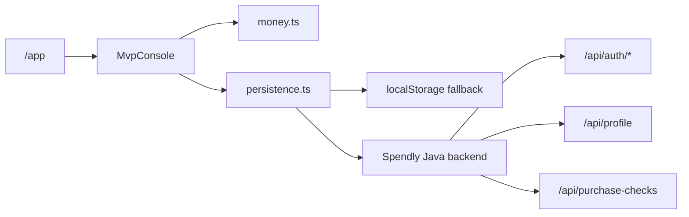

# Spendly Frontend Architecture

Spendly is a Next.js PWA for pre-spend decision support. The frontend keeps the
interactive money logic local and delegates authenticated persistence to the
Spendly Java backend.

## Goals

- Keep the safe-to-spend calculation pure and testable.
- Allow local-only usage when no backend URL is configured.
- Support email OTP sign-in through the backend.
- Persist profile and recent purchase checks through backend APIs.
- Keep the app suitable for a Capacitor iOS shell.

## Runtime Flow



## Key Files

- `src/app/app/page.tsx` renders the app shell.
- `src/components/mvp-console.tsx` owns the interactive UI state.
- `src/lib/money.ts` contains safe-to-spend calculations.
- `src/lib/persistence.ts` chooses backend API mode or localStorage mode.

## Persistence Modes

Local mode is used when `NEXT_PUBLIC_API_BASE_URL` is missing or the backend is
not reachable during startup. Data is stored in browser localStorage only.

Backend mode is used when `NEXT_PUBLIC_API_BASE_URL` is configured. The adapter
stores the backend session in localStorage, sends the access token as a bearer
token, and calls the Java API for profile and purchase-check data.

## Backend API Contract

Auth:

```http
POST /api/auth/send-otp
POST /api/auth/verify-otp
POST /api/auth/refresh
GET  /api/auth/me
```

Spendly data:

```http
GET    /api/profile
PUT    /api/profile
GET    /api/purchase-checks
POST   /api/purchase-checks
DELETE /api/me/data
```

## Environment

```bash
NEXT_PUBLIC_API_BASE_URL=http://localhost:8080
```

For production and TestFlight builds, set this to the Railway backend HTTPS URL.

## iOS Notes

The Capacitor shell should point at the deployed HTTPS frontend. The frontend in
turn calls the backend URL from `NEXT_PUBLIC_API_BASE_URL`, so the backend must
include the deployed frontend origin in its CORS allow-list.
